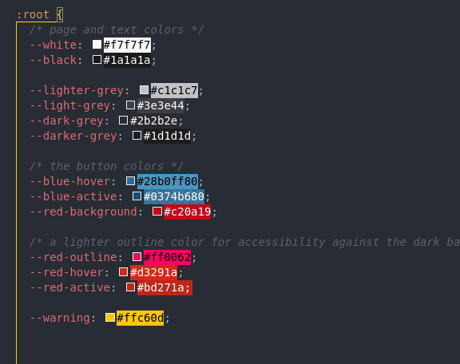
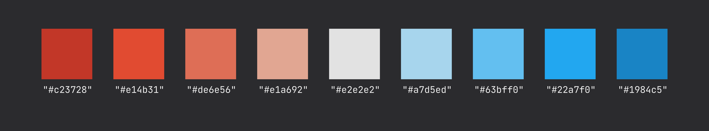

# Project 2 - Chart my data

&nbsp;

Site url:

Repository for the project: https://github.com/dmcginley/project2-chart-my-data

Live website: https://dmcginley.github.io/project2-chart-my-data/

Sample data: [csv file](https://drive.google.com/file/d/1WBMsYecjmRCDqG8RzApDp8Nmv5wLSE9E/view?usp=sharing)

&nbsp;

## Wireframe

## Who is this website for
If you have some data (a CSV file) you'd like to visualise...
Display chart data to better understand your data trends in the chart that you otherwise wouldn't see.
People wishing to view either bar charts, stacked bar charts or line charts.
People wishing to see multiple data rows, as the website can pull in all the data.
 

## User Stories
## Technologies Used
### The Code
* **HTML, CSS & JavaScript**

### Libraries used
- **Chart.js** https://www.chartjs.org/docs/latest/
- **Papa Parse** https://www.papaparse.com/

### Graphic/UX Design
* **Figma, Gimp, & Inkscape.**

## Design Decisions

I decided to create a website that would take the user on a journey for uploading a CSV file to be able to view it as a chart, rather than just having a chart and expecting that they would automatically know what to do with it.

In the hero section the main (call to action) button, when clicked prompts you to upload a CSV file while at the same time scrolls to where your chart will display.

under the chart & chart buttons there is another, call to action button for uploading another chart, so you don't have to scroll to the top again to upload another file.

The site and chart are created with the user in mind using a dark theme which is commonplace for viewing data or technical information where you have to concentrate on the numbers/data.

The interface is created with a clean design with easy to read text, so that the user can concentrate on the task at hand.

## Features

- Navigation

- How To

- Footer

	The Footer is simple, minimalist designe with Site *created by Donnchadh Mc Ginley* as the only text. 

 
## Typography
- FONT (fill in) for the h1, h2 and h3 as a strong, clean, easy to read font.
- FONT (fill in) for the body, modern and easy to read, keeping it clean with the chart

## Color Choices

#### Chart Colors

#### CSS root Selector
**:root Selector - pseudo-class selector**

I used the :root Selector for creating a personalised color set.
As it an easy way to track colors across the elements while keeping the number of colors small.User Stories

## Responsiveness

I created the website using mobile first.

The chart is set to **responsive: true,** which is a Chartjs boolean, I cane across the and other settings reading up on the [documentation.](https://www.chartjs.org/docs/latest/configuration/responsive.html)

The website has a basic Grid for the main area, and the same grid for the header element so that the content on both doesn't stretch to the far left and right of larger screens, e.g. QHD or 4K monitors.

## Accessibility
- 'alt' text is applied to every image/icon. 

- Contrasting colors.
 	* Easy to see buttons and navigation area.
	* Off-white text against a black background.
	

## Consistency
- The fonts match, the header fonts and content (paragraph) fonts.
- The padding is the same or similar for each element across the website.
- Text size in rem and box/container padding is in em. 

## Testing

*All tested in Incognito mode.*

### Lighthouse in Chrome DevTools

### Validator Testing
- **HTML**
<https://validator.w3.org/>

- **CSS**
<https://jigsaw.w3.org/css-validator/>

### Manual Testing
*...and how I went about it.*

The web browsers I used in manual testing are Chrome, Firefox, Microsoft Edge, and Opera.

I checked that the responsive design didn't break when changing the aspect ratio (from mobile to QHD)

### Responsive Testing

I used Chrome and Firefox "developer tools, device toggle" to check the responsiveness for each device. From iPhone, roughly 320px, to laptop 1920px, and to the desktop at 2560px (QHD).

## Error Handling

- Chart wasn't showing, error in displaying the dataSetNames array. which is the names of the bars (or points on the line).
- Buttons were not showing correctly.
- Column 0 was showing which is the date column and the button for loop (function createDataSetButtons) was creating a button for that which wouldn't click, I fixed this by skipping the first column in the CSV file.

Zoom feature wasn't working properly, it wouldn't reset back to 100% after button click (I think it had something to do with there being two charts), didn't have time to implement this feature correctly, so I left it out.

## Deployment

## Image optimization for the web ???

## Resources
*General reading and resources.*

- [uxplanet.org *8 Tips for Dark Theme Design*](https://uxplanet.org/8-tips-for-dark-theme-design-8dfc2f8f7ab6) 

- [4 Ways to Empty an Array in JavaScript](https://www.javascripttutorial.net/array/4-ways-empty-javascript-array/?utm_source=pocket_mylist)

- [User Stories *from Mountain Goat Software.com*](https://www.mountaingoatsoftware.com/agile/user-stories)

#### Color
- [Data Color Picker](https://learnui.design/tools/data-color-picker.html)
- [Chroma.js Color Palette Helper - *used as a base for my choice of colors*](http://vis4.net/palettes/#/9|s|00429d,96ffea,ffffe0|ffffe0,ff005e,93003a|1|1)
- [VIZ PALETTE - *by Elijah Meeks & Susie Lu*](https://projects.susielu.com/viz-palette?colors=[%22#fffba2%22,%22#ffd700%22,%22#ffb14e%22,%22#fa8775%22,%22#ea5f94%22,%22#cd34b5%22,%22#9d02d7%22,%22#361ae5%22]&backgroundColor=%22white%22&fontColor=%22black%22&mode=%22normal%22)
- [Papa Parse - *Documentation*](https://www.papaparse.com/docs)

#### Books 
- [Eloquent JavaScript - *by Marijn Haverbeke*](https://www.goodreads.com/book/show/52016825-javascript)

- [JavaScript and jQuery: Interactive Front-End Web Development - *by Jon Duckett*](https://www.goodreads.com/book/show/16219704-javascript-and-jquery)

## Credits
*Sites content, media, and help with implementing code for tutorials/online help.*

- [w3schools](https://www.w3schools.com/js/default.asp) - JavaScript
- [Mozilla Developer](https://developer.mozilla.org/en-US/docs/Web/JavaScript) - JavaScript
- [d3js](https://d3js.org/)
- 
- 
- 

#### Tutorials

- [Code Institute](https://learn.codeinstitute.net/courses/course-v1:CodeInstitute+LMR101+2021_T1/courseware/73e9c0413ead4a21b389e33c77706102/4fe6474cab114387ad0e72bf7ec1c201) - working with Arrays & Objects.

- [Tabular Data - Working With Data & APIs in JavaScript](https://www.youtube.com/watch?v=RfMkdvN-23o)

- [JavaScript Programming Tutorial 39 - Average of Array Values](https://www.youtube.com/watch?v=QgUnJhUTGoI)

- [JavaScript Break and Continue](https://www.w3schools.com/js/js_break.asp) - to break out of the loop for the buttons.

- [How to Parse CSV String in Javascript with Papaparse JS](https://www.youtube.com/watch?v=s6SgVjIvIV8&list=PLPZlbsSRAxIpfL9s3LPCXqllojDEqxAXl&index=11) - using PapaParse.

- [How to Create a Chart with a Remote CSV File with Chart JS](https://www.youtube.com/watch?v=HFAjrai-d58)

## Content
The how to use text on the home page.

class = **"note-text-container"**
[Bar Graph vs Line Graph *from https://www.smartdraw.com*](https://www.smartdraw.com/bar-graph/#:~:text=data%20over%20time.-,Bar%20Graph%20vs%20Line%20Graph,differences%20in%20data%20among%20groups.)
