# Project 2 - Chart Data

&nbsp;

Site URL:

Repository for the project: https://github.com/dmcginley/project2-chart-my-data

Live website: https://dmcginley.github.io/project2-chart-my-data

&nbsp;

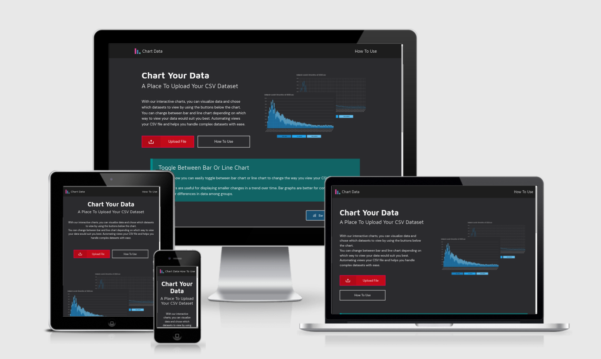

## Table of contents

  - [Sample data](#sample-data)
  - [Wireframe](#wireframe)
  - [Who is this website for](#who-is-this-website-for)
  - [User Stories](#user-stories)
  - [Technologies Used](#technologies-used)
    - [The Code](#the-code)
    - [Libraries used](#libraries-used)
    - [Graphic/UX Design](#graphicux-design)
  - [Design Decisions](#design-decisions)
  - [Features](#features)
  - [Typography](#typography)
  - [Color Choices](#color-choices)
  - [Responsiveness](#responsiveness)
  - [Accessibility](#accessibility)
  - [Consistency](#consistency)
  - [Testing](#testing)
    - [Lighthouse in Chrome DevTools](#lighthouse-in-chrome-devtools)
    - [Validator Testing](#validator-testing)
    - [Manual Testing](#manual-testing)
    - [Responsive Testing](#responsive-testing)
  - [Error Handling](#error-handling)
  - [Deployment](#deployment)
  - [Image optimization for the web](#image-optimization-for-the-web)
  - [Resources](#resources)
  - [Credits](#credits)
  - [Content](#content)

&nbsp;

## Sample data 
Sample data that can be downloaded to use with the chart.

- The first 3 months of 2021 COVID-19 data - [CSV file](https://drive.google.com/file/d/1nsoUh3Pp302tMsWz9uwc1k_Zd2s5S0fe/view?usp=sharing)
	- New cases
	- ICU patients
	- Hospital  patients

- From March 2020 to 2022 COVID-19 data (large file) - [CSV file](https://drive.google.com/file/d/1XbEdQbq3UYtUdEiQdid8iNkA0w8PGyua/view?usp=sharing)
	- New cases
	- ICU patients
	- Hospital  patients

- No Data (for error message) - [CSV file](https://drive.google.com/file/d/15pfsWnD3Nvs5W4HgriZPR7_Ea0MPljMJ/view?usp=sharing)
	- CSV only has the first column (so this file will through up an error).

- JPG file (for error message) - [JPG file](https://drive.google.com/file/d/1ZI__TFeOJm2rC7811bv0INWjDGjNOUwl/view?usp=sharing)
	- File is not a CSV file (so this file will through up an error).

## Wireframe

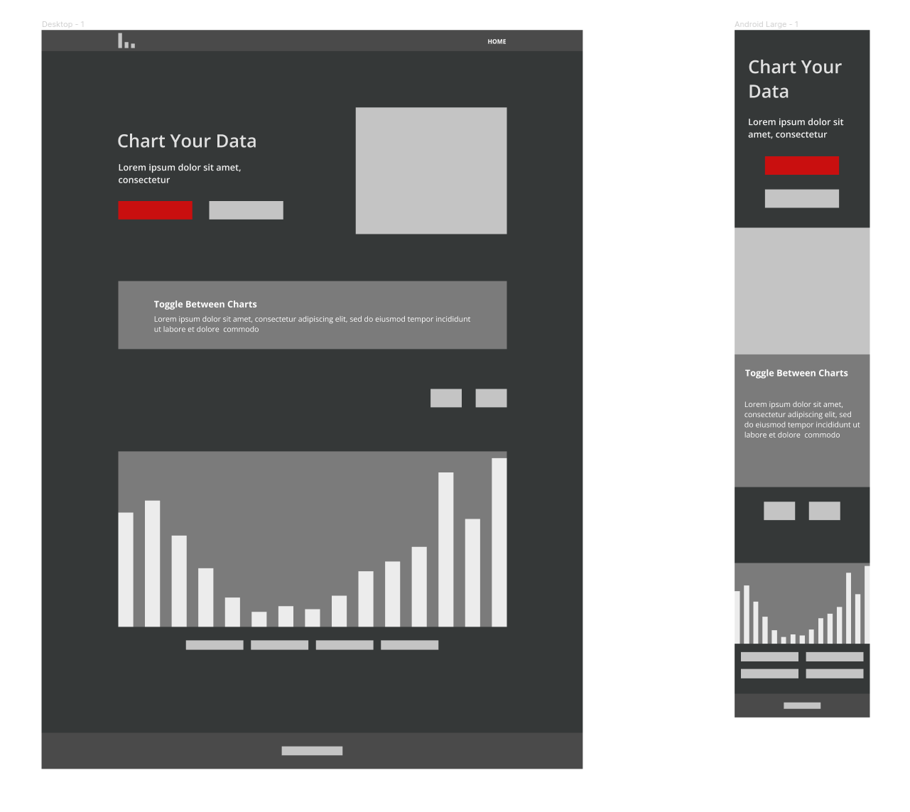

## Who is this website for
If you have some data (a CSV file) you'd like to visualize...
Display chart data to better understand your data trends in the chart that you otherwise wouldn't see.
For people wishing to view either stacked bar charts or line charts.
For people wishing to see multiple data rows, as the website can pull in all the data.
 

## User Stories

*"As a user, I want to be able to upload a CSV file to a chart so that I will be able to view my date more visually."***

Acceptance criteria:

- Chart upload button.

- User’s CSV displays on chart.

&nbsp;

*"As a user, I want to view my chart with a dark theme to lessen my eye strain from bright screens."*

Acceptance criteria:

 - Dark theme with lighter chart and chart elements.

- Buttons kept lighter than the background.

- Correct contrast between colors for the dark theme.

&nbsp;

*"As a user, I’d like to be able to toggle between line and bar chart so that I could change to the view that suited my data better."*

Acceptance criteria:

- Create chart-type toggle buttons.

&nbsp;

*"I’d like to be able to understand what to do straight away, so I’d be able to save time and spend more time on my figures."*

Acceptance criteria:

- Give a short summary of use in the hero section.

- Create a how-to-use page.

&nbsp;

*"When working with a chart, I’d like to be able to turn on and off datasets, so I could sometime just view one set. As opposed  to having to view them all."*

Acceptance criteria:

- Buttons below the chart representing the data in the chart.

- Ability to toggle them on and off.

- Greyed out when inactive.

&nbsp;

*"As a user, I’d like a how-to page that clearly outlines how to use the web app, so that I don’t miss out on anything."*

Acceptance criteria:

- Create how-to page.

- Describe the chart’s functionality.

- Incorporate images to show where each element is.

&nbsp;

*"On the chart site, I want to be able to get back to the chart from anywhere, so as not to get lost on the site."*

Acceptance criteria:

- Upload buttons created for easy navigation.

- Home and how to use a link to get to the relevant parts of the site.

- "Go to chart" button on the how-to page to take you directly to the chart.

&nbsp;

*"I’d like to be able to download the sample data file, so I could play around with it."*

Acceptance criteria:

- Added download icon next to filename text.

&nbsp;

*"As a user, when I upload my file, I’d like to see the name of the file next to the chart, so I can always be reminded of which file I’m looking at."*

Acceptance criteria:

- Added element that takes the name from the file and displays it above the chart.

&nbsp;

*"If I have done something wrong, I’d like to be given a warning or error message so that I see how to fix my file."*

Acceptance criteria:

- Added error message for less than two columns.

- Added error message for a file that isn’t a CSV file.

## Technologies Used
### The Code
* **HTML, CSS & JavaScript**

### Libraries used
- **Chart.js** https://www.chartjs.org/docs/latest/
- **Papa Parse** https://www.papaparse.com/

### Graphic/UX Design
* **Figma, Gimp, & Inkscape.**

## Design Decisions

I decided to create a website that would take the user on a journey for uploading a CSV file to be able to view it as a chart, rather than just having a chart and expecting that they would automatically know what to do with it.

In the hero section, the main (call to action) button has a stronger color, when clicked prompts you to upload a CSV file while at the same time scrolls to where your chart will display.

The site and chart are created with the user in mind using a dark theme which is commonplace for viewing data or technical information where you have to concentrate on the numbers/data.

The interface is created with a clean design with easy-to-read text, so that the user can concentrate on the task at hand.

## Features

- Navigation

	The upload button in the hero section makes it easy to see what you're to do.

	The red button is it's the first thing you would want to use on the site.
It will bring you down to the chart and prompt you to upload a file. It's an input element with type="file".

	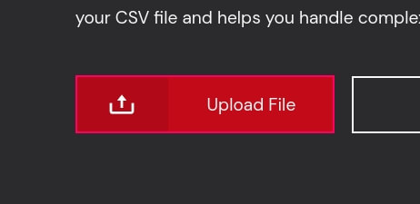

	Chart toggle button

	So you can toggle between the two types of charts.

	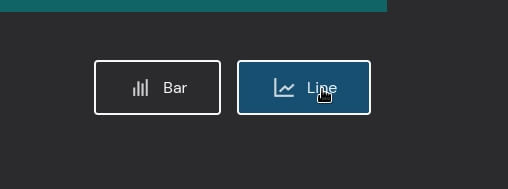

- The Chart title

	The default text has a download link beside it so you can download the file if you wish to.
The text changes to the text of the file uploaded by the user, (and the download link dissipaters).

	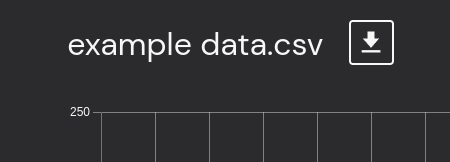

- The Chart buttons
	
	Under the chart & chart buttons there is another, call to action button for uploading another chart, so you don't have to scroll to the top again to upload another file.

	

	As you toggle the button a part of the button keeps the color so that you can see which color it would relate to.

	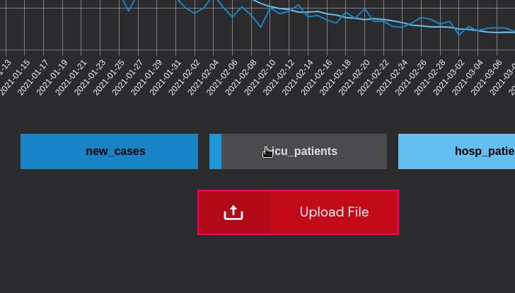

- How To Page

	I decided to create a how-to page so that people wouldn't just be confronted with a chart of data and be expected to know what to do with it. 

	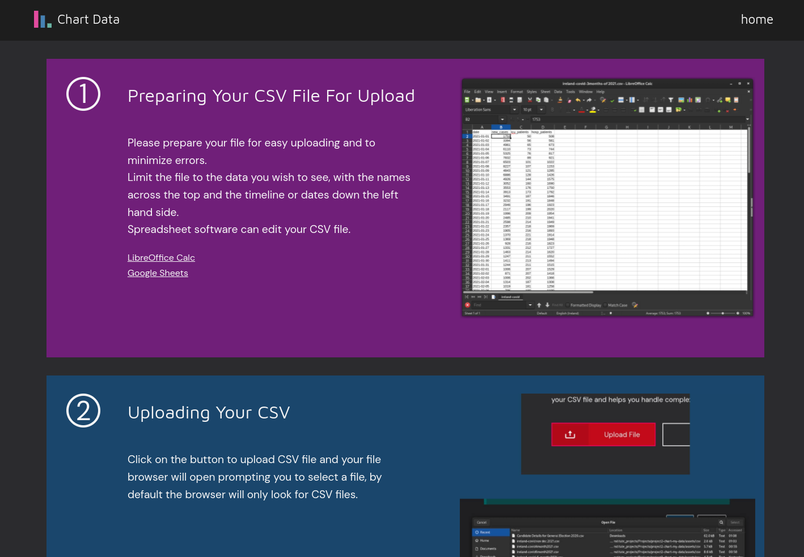

- Footer

	The Footer is a simple, minimalist design with Site *created by Donnchadh Mc Ginley* as the only text element.

	
 
## Typography
- Maven Pro *(with a fallback of sans-serif)* - for the h1, h2, and h3 as a strong, clean, easy to read font.
- DM Sans *(with a fallback of sans-serif)* - for the body, modern and less stylized, easy to read so in keeping it clean with the chart

## Color Choices

#### CSS root Selector
**:root Selector - pseudo-class selector**

I used the :root Selector for creating a personalized color set.
As it is an easy way to track colors across the elements while keeping the number of colors small.User Stories

#### Chart Colors
I chose the chart color from the website [Chroma.js Color Palette Helper.](http://vis4.net/palettes/)
 I used their palette as a base for my colors, keeping the colors bright against the dark background of the site. I checked every color passes the Chrome devtools.

## Responsiveness

I created the website using mobile-first.

The chart is set to **responsive: true,** which is a Chartjs boolean, I came across this and other settings reading up on the Chartjs [documentation.](https://www.chartjs.org/docs/latest/configuration/responsive.html)

The website has a basic Grid for the main area, and the same grid for the header element so that the content on both doesn't stretch to the far left and right of larger screens, e.g. QHD or 4K monitors.

## Accessibility
- 'alt' text is applied to every image/icon. 

- Contrasting colors.
 	* Easy to see buttons and navigation area.
	* Off-white text against a black background.

## Consistency
- The fonts match, the header fonts and content (paragraph) fonts.
- The padding is the same or similar for each element across the website.
- Text size in rem and box/container padding is in em. 

## Testing

*All tested in Incognito mode.*

### Lighthouse in Chrome DevTools

I found after doing the first check, the home page was getting a low score of 76 or 80 for performance, I researched how to solve the issue and added "defer" to the main.js script as it doesn't need to load straight away allowing for the page to completely load first.
 
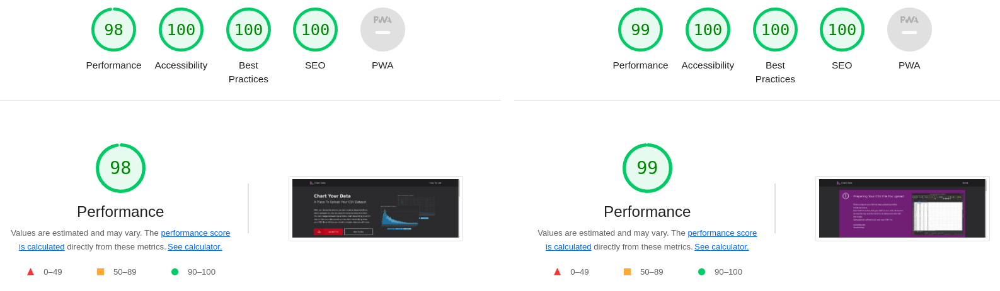

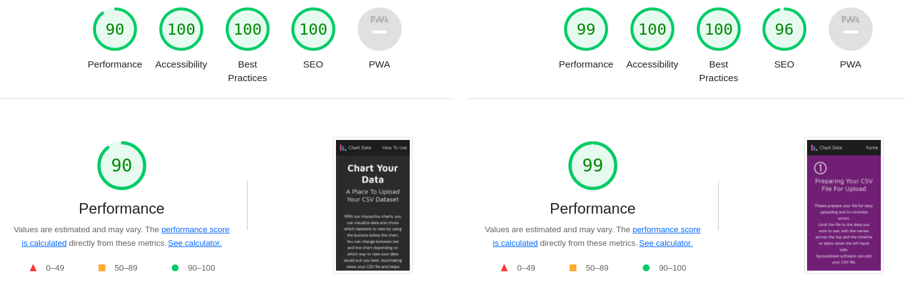

### Validator Testing
- **HTML**
<https://validator.w3.org/>

	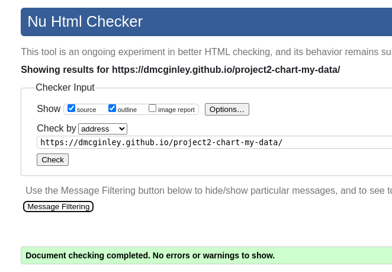

	I initially had a few errors, < a > tag missing the nofollow or noopener.

	Small spelling mistakes.

- **CSS**
<https://jigsaw.w3.org/css-validator/>

	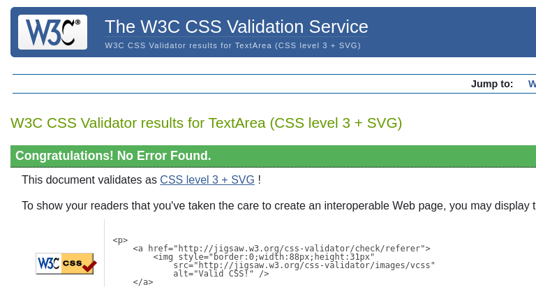
- **JS**
<https://jshint.com/>

	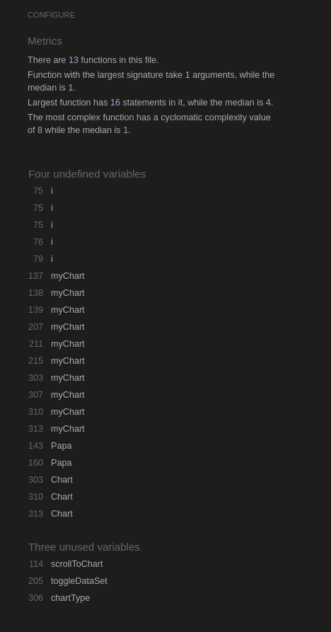

The 3 "unused variables" refer to the functions that are not called inside the JS file, they are callbacks from the HTML page.

### Manual Testing
*...and how I went about it.*

The web browsers I used in manual testing are Chrome, Firefox, Microsoft Edge, and Opera.

I checked that the responsive design didn't break when changing the aspect ratio (from mobile to QHD).

I uploaded several CSV files checking load times, and that all the buttons were working.

Checked each time that it switched between the bar and line chart smoothly.

Checked each button went to the proper location.

### Responsive Testing

I used Chrome and Firefox "developer tools, device toggle" to check the responsiveness for each device. From iPhone, roughly 300px, to laptop 1920px, and to the desktop at 2560px (QHD).

On larger screens, I made sure that the chart did get too large as after a certain size it became clumsy to use.

## Error Handling

- I implemented it to show an error when you would upload an image, as before that PapaParse would still parse the image into an array, so it wouldn't catch the error,

- I also set a limit of two columns so you couldn't upload a blank file.

- Chart wasn't showing, an error in displaying the dataSetNames array. which are the names of the bars (or points on the line).
- Buttons were not showing correctly.
- Column 0 was showing which is the date column and the button for loop (function createDataSetButtons) was creating a button for that which wouldn't click, I fixed this by skipping the first column in the CSV file.

- I changed the "hitRadius" so that the chat (especially the line chart) is easier to hover on, I found this from reading the [Chartjs docs.](https://www.chartjs.org/docs/latest/charts/line.html)

- [jshint](https://jshint.com/) was showing a error so I reformated the clearData() function.

## Deployment
Deployed using GitHub Pages. <https://github.com/dmcginley/project2-chart-my-data/settings/pages>

I went to my  Repository (project2-chart-my-data), and under the "Settings" tab went down to the "Pages" section on the left menu.
There I could easily deploy my site. 

Once everything was deployed I checked everything was working ok. I checked that the files would upload ok. I checked response times and refresh time, the links, and the buttons.

Chart Data can be found here - https://dmcginley.github.io/project2-chart-my-data (same link as above)

## Image optimization for the web

For all the images I edited them in [Gimp](https://www.gimp.org/) changing the resolution when required. I'd pass the images through
Tinypng and then put them in the image folder.
- [Tinypng](https://tinypng.com/)

- [favicon.io](https://favicon.io/favicon-converter/) - used for generating the set of images for the tab in the browser.

## Resources
*General reading and resources.*

- [uxplanet.org *8 Tips for Dark Theme Design*](https://uxplanet.org/8-tips-for-dark-theme-design-8dfc2f8f7ab6) 

- [4 Ways to Empty an Array in JavaScript](https://www.javascripttutorial.net/array/4-ways-empty-javascript-array/?utm_source=pocket_mylist)

- [User Stories *from Mountain Goat Software.com*](https://www.mountaingoatsoftware.com/agile/user-stories)

- [Papa Parse - *Documentation*](https://www.papaparse.com/docs)

- [Acceptance Criteria](https://www.productplan.com/glossary/acceptance-criteria/#:~:text=In%20Agile%2C%20acceptance%20criteria%20refer,consider%20the%20user%20story%20finished.)

#### Color
- [Data Color Picker](https://learnui.design/tools/data-color-picker.html)
- [Chroma.js Color Palette Helper - *used as a base for my choice of colors*](http://vis4.net/palettes)
- [VIZ PALETTE - *by Elijah Meeks & Susie Lu*](https://projects.susielu.com/viz-palette?colors=[%22#fffba2%22,%22#ffd700%22,%22#ffb14e%22,%22#fa8775%22,%22#ea5f94%22,%22#cd34b5%22,%22#9d02d7%22,%22#361ae5%22]&backgroundColor=%22white%22&fontColor=%22black%22&mode=%22normal%22)

#### Books 
- [Eloquent JavaScript - *by Marijn Haverbeke*](https://www.goodreads.com/book/show/52016825-javascript)

- [JavaScript and jQuery: Interactive Front-End Web Development - *by Jon Duckett*](https://www.goodreads.com/book/show/16219704-javascript-and-jquery)

## Credits
*Sites content, media, and help with implementing code for tutorials/online help.*

- [w3schools](https://www.w3schools.com/js/default.asp) - JavaScript
- [Mozilla Developer](https://developer.mozilla.org/en-US/docs/Web/JavaScript) - JavaScript
- [d3js](https://d3js.org/)
- [Efficiently load third-party JavaScript](https://web.dev/efficiently-load-third-party-javascript/)
- [meta description](https://web.dev/meta-description/?utm_source=lighthouse&utm_medium=devtools)

#### Tutorials

- [Code Institute](https://learn.codeinstitute.net/courses/course-v1:CodeInstitute+LMR101+2021_T1/courseware/73e9c0413ead4a21b389e33c77706102/4fe6474cab114387ad0e72bf7ec1c201) - working with Arrays & Objects.

- [Tabular Data - Working With Data & APIs in JavaScript](https://www.youtube.com/watch?v=RfMkdvN-23o)

- [JavaScript Programming Tutorial 39 - Average of Array Values](https://www.youtube.com/watch?v=QgUnJhUTGoI)

- [JavaScript Break and Continue](https://www.w3schools.com/js/js_break.asp) - to break out of the loop for the buttons.

- [How to Parse CSV String in Javascript with Papaparse JS](https://www.youtube.com/watch?v=s6SgVjIvIV8&list=PLPZlbsSRAxIpfL9s3LPCXqllojDEqxAXl&index=11) - using PapaParse.

- [How to Create a Chart with a Remote CSV File with Chart JS](https://www.youtube.com/watch?v=HFAjrai-d58)

- [How to Write Good User Stories](https://www.youtube.com/watch?v=tKSUokG3Y0w)

## Content
The "how to use" text on the home page, (Toggle Between Bar Or Line Chart section).

class = **"note-text-container"**
[Bar Graph vs Line Graph *from https://www.smartdraw.com*](https://www.smartdraw.com/bar-graph/#:~:text=data%20over%20time.-,Bar%20Graph%20vs%20Line%20Graph,differences%20in%20data%20among%20groups.)

Image of cat for error message downloaded from [pexels](https://www.pexels.com/photo/photo-of-orange-tabby-cat-with-red-handkerchief-1741205/).
